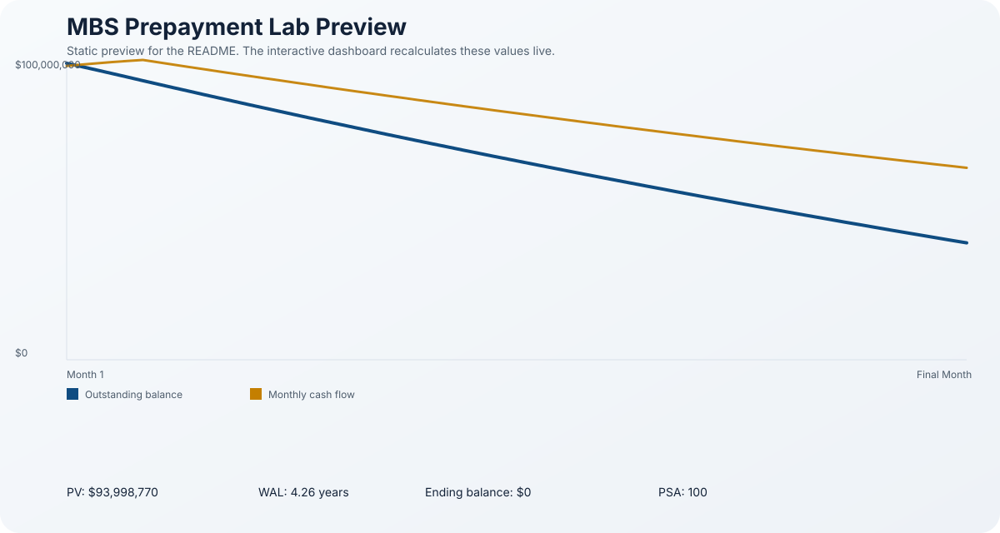

# Risk Engine

Fixed-income analytics sandbox with an interactive MBS prepayment lab.

## What It Does

This project combines three pieces that matter on a fixed-income desk:

- Treasury curve ingestion from FRED
- bond reference discovery from SEC filings
- mortgage-backed securities scenario analysis with live controls

The highlight is the MBS Prepayment Lab. It lets you stress a mortgage pool against the Treasury curve and see how PSA, refinance incentive, and discount spread affect projected cash flows, PV, and WAL.

## MBS Prepayment Lab



The interactive dashboard is generated locally as:

- [docs/assets/mbs-prepayment-lab.html](docs/assets/mbs-prepayment-lab.html)

It includes:

- sliders for UPB, WAC, remaining term, seasoning, PSA, market rate, discount spread, and refinance sensitivity
- live projection of balance burn-down and monthly cash flow
- PV and WAL outputs
- a 12-month schedule table
- a Treasury-curve anchor so the scenario is tied to market data instead of being a standalone toy

This is designed to feel relevant to an MBS desk because it answers the questions people actually ask:

- what happens if rates rally?
- how quickly does the pool pay down under a higher PSA?
- what is the value of the pool against the current curve?
- how sensitive is the profile to refinance incentive?

## Treasury Dashboard

The repo also keeps a cleaner fixed-income curve dashboard for the Treasury side of the workflow.


That view shows:

- the Treasury curve from FRED
- a curve summary panel
- the bond reference output used for pricing and DV01

## Example Run

Default mode:

```bash
python main.py
```

MBS lab mode:

```bash
python main.py --mbs-lab
```

Typical output from the MBS lab looks like:

```text
Built the MBS Prepayment Lab.
Interactive dashboard: docs/assets/mbs-prepayment-lab.html
Preview graphic: docs/assets/mbs-prepayment-lab-preview.svg
PV: 102384477.92
WAL: 4.81 years
Ending balance: 0.00
```

## How To Run

Create a `.env` file in the project root:

```env
FRED_API_KEY=your_fred_key_here
SEC_USER_AGENT=risk-engine/0.1 (yourname@example.com)
BOND_IDENTIFIER=IBM
```

Useful optional MBS lab inputs:

```env
MBS_UPB=100000000
MBS_WAC=5.500
MBS_TERM_MONTHS=300
MBS_SEASONING_MONTHS=24
MBS_PSA=100
MBS_MARKET_RATE=4.750
MBS_DISCOUNT_SPREAD_BPS=25
MBS_REFI_SLOPE_CPR=8
```

## Why It Matters

This is no longer just a boilerplate bond pricer. It now demonstrates:

- market data ingestion
- reference data extraction
- pricing and DV01
- MBS scenario analysis
- interactive dashboard generation

That combination reads much more like a desk-facing prototype than a generic tutorial project.

## Repo Layout

```text
src/risk_engine/
  instruments/   # bonds, mortgages, treasuries, swaps
  marketdata/    # yield curve models and source adapters
  reference/     # SEC bond reference discovery
  services/      # pricing, DV01, and MBS scenario logic
  frontend/      # plotting and dashboard generation
```

## Current Limits

This is still a prototype, so a few shortcuts remain:

- SEC data is used for bond reference terms, not traded bond yields
- the mortgage lab uses a deterministic PSA-style prepayment model
- the discounting logic is a simplified scenario model, not a full stochastic OAS engine

Those choices keep the repo understandable while still making the feature useful and desk-relevant.

## Next Up

- add tranche-level MBS support
- add a scenario comparison view
- export the MBS dashboard as a standalone HTML report bundle
- add spread duration / convexity for the mortgage pool
