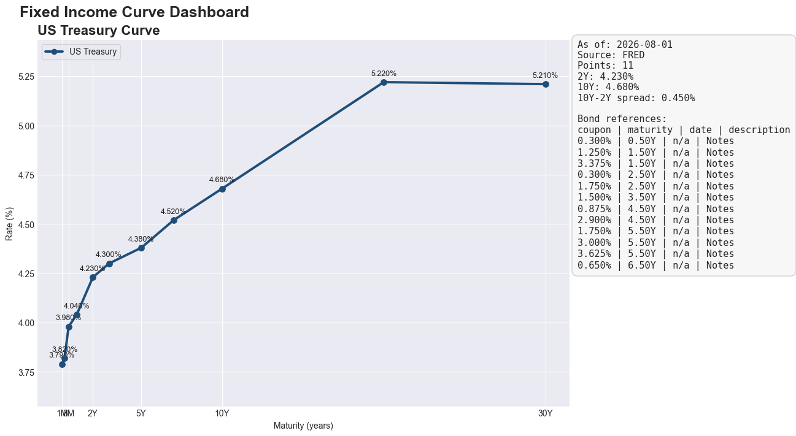

# Risk Engine

Fixed-income curve dashboard and pricing sandbox in Python.

## What It Does

This project turns live market data and SEC filing data into a compact fixed-income workflow:

- pulls the U.S. Treasury curve from FRED
- discovers bond reference issues from SEC filings
- prices a plain fixed-rate bond off the Treasury curve
- computes DV01 for that bond
- renders a dashboard with the Treasury curve and a reference table of SEC bond terms

The key idea is simple: Treasury data gives you the rate curve, and SEC filings give you bond structure. Together, they make a useful local sandbox for pricing and relative-value exploration.

## Why This Exists

The repo is intentionally small, but it demonstrates a full fixed-income loop:

- market data ingestion
- domain models for bonds and curves
- pricing and risk calculations
- visualization and reporting

That makes it useful as a portfolio piece because the code is easy to follow, but the workflow is still realistic.

## Dashboard



The chart shows:

- the Treasury curve as the main line
- a side-panel reference table of SEC bond coupon terms and maturities
- a curve summary with the 2Y/10Y spread

The SEC bond table is deliberately labeled as reference data. It is not a yield curve. It shows coupon, maturity, and description so the pricing model has context without pretending that coupons are market yields.

## Example Output

Running the demo prints a short fixed-income snapshot like this:

```text
Loaded Treasury curve from FRED.

Loaded 12 bond coupon references from SEC EDGAR
  1. coupon 0.300% | 0.50Y | n/a | Notes
  2. coupon 1.250% | 1.50Y | n/a | Notes
  3. coupon 3.375% | 1.50Y | n/a | Notes

Representative issue
  Issuer: INTERNATIONAL BUSINESS MACHINES CORP
  Coupon: 0.300%
  Maturity years: 0.50
  Treasury spot at maturity: 3.980%
  Coupon minus Treasury spot: -3.680%

Model price: 98.2146
DV01: 0.004723
```

## How To Run

Create a `.env` file in the project root with your API settings:

```env
FRED_API_KEY=your_fred_key_here
SEC_USER_AGENT=risk-engine/0.1 (yourname@example.com)
BOND_IDENTIFIER=IBM
```

Then run:

```bash
python main.py
```

If `BOND_IDENTIFIER` is set, the app will:

- fetch recent bond-related SEC filings for that issuer
- print the extracted coupon references
- choose a representative issue for pricing
- write the dashboard image to `docs/assets/readme-dashboard.png`
- open the Treasury dashboard

## Good Identifiers To Try

These issuers usually produce cleaner SEC debt references than a noisy equity ticker:

- `IBM`
- `MSFT`
- `ORCL`
- `CRM`
- `USB`
- `DE`

## Repo Layout

```text
src/risk_engine/
  instruments/   # bond and rate instrument models
  marketdata/    # yield curve models and source adapters
  reference/     # SEC bond reference discovery
  services/      # pricing and DV01 logic
  frontend/      # plotting and presentation helpers
```

`main.py` is the local demo entry point. It is designed to be read, run, and modified quickly.

## Current Limits

This is still a reference-and-pricing sandbox, not a production bond analytics stack.

- SEC data is used for coupon and maturity reference data, not traded bond yields
- the pricer assumes a plain fixed-rate bond
- the curve logic uses a simple spot-rate model

Those limits are intentional. They keep the project understandable while still leaving room for future upgrades.

## Next Up

- add clean price versus dirty price
- support real bond yield or spread inputs
- improve SEC parsing for more exact maturity extraction
- add a report export so the dashboard can be shared as a static artifact

